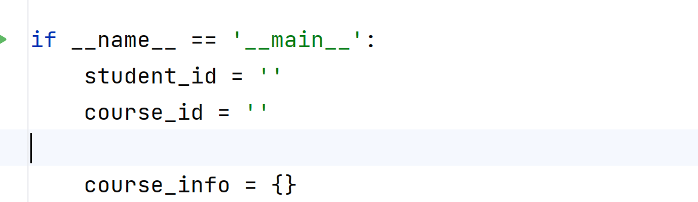
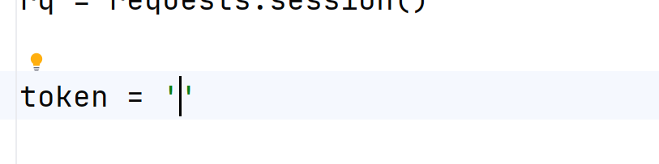
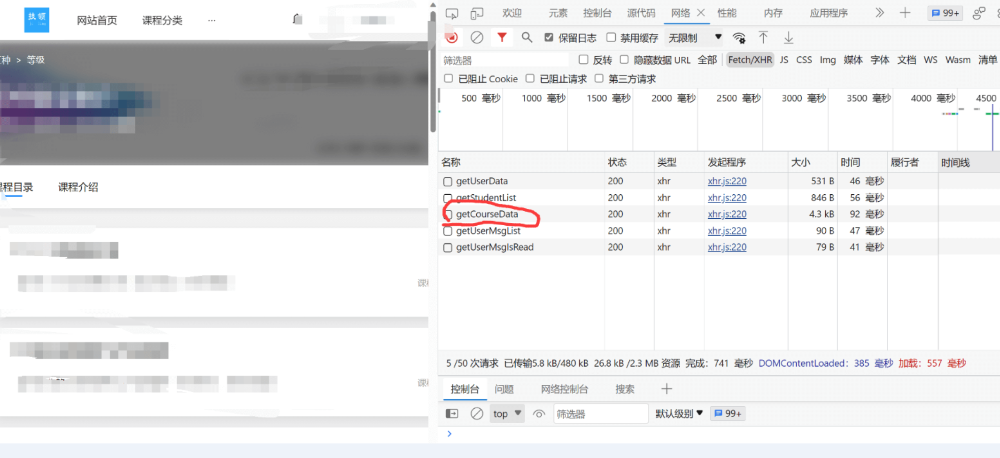
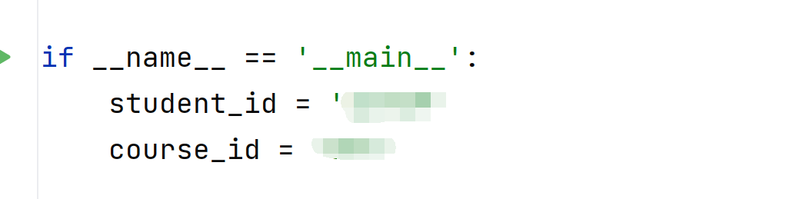
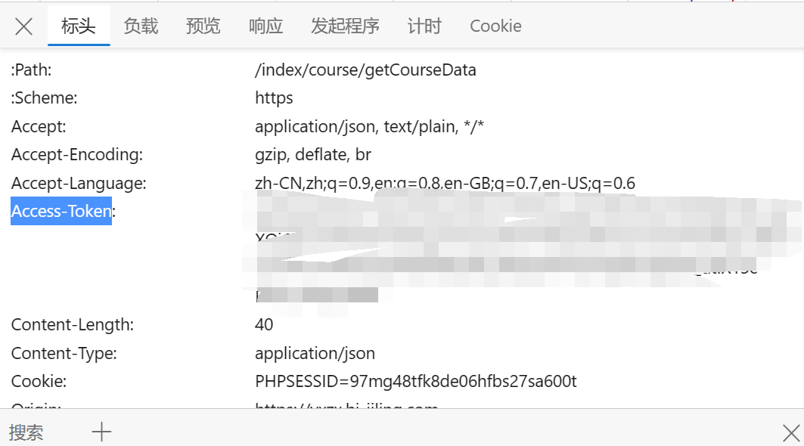

# 技领学习平台自动化完成课程
## 软件的代码修改这两个地方
- 
-  
## 使用教程
1. 登录网站 https://yxzx.bj-jiling.com/#/login
2. 进入课程
3. 打开开发者工具
   - 下载getCourseData接口的响应内容[`点一下请求，在响应中，全部复制`]，替换软件目录的course.json 
   - 记住请求头`点一下请求，在负载中`的`course_id和student_id`的值，存到代码中   
   - 复制请求头的`Access-Token`，添加到程序代码的`token`中  
4. 安装依赖 `pip i -r requirements.txt`
5. 运行程序 `python main.py`
## 如果观看中有视频/照片认证，建议使用以下代码（脚本不会有任何的图片验证，所以会被判定为刷课）
打开`视频播放页`，控制台输入
```js
setInterval(() => {
  window.onblur = () => {};
  document.onvisibilitychange = () => {};
  // 1.5倍速，该成自己想要的速度
  document.querySelector('video').playbackRate = 1.5;

  let btn = document.querySelector('.video-tool-bottom .anticon');
  if (btn.classList.contains('anticon-caret-right')) {
    btn.click();
  }
}, 1000); // 这里的1000是定时器的间隔时间，单位为毫秒
```
